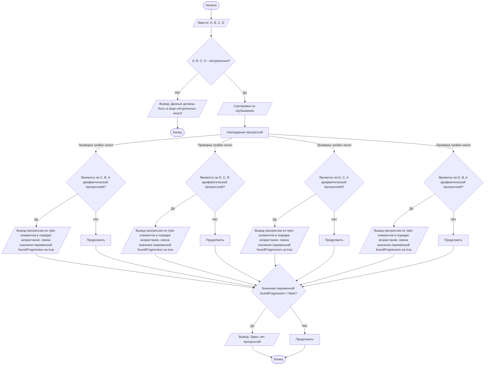

## Отчет по лабораторной работе № 1

#### № группы: `ПМ-2401`

#### Выполнил: `Худяков Матвей Иванович`

#### Вариант: `28`

### Cодержание:

- [Постановка задачи](#1-постановка-задачи)
- [Входные и выходные данные](#2-входные-и-выходные-данные)
- [Выбор структуры данных](#3-выбор-структуры-данных)
- [Алгоритм](#4-алгоритм)
- [Программа](#5-программа)
- [Анализ правильности решения](#6-анализ-правильности-решения)

### 1. Постановка задачи
- Условие задачи
>Даны четыре натуральных числа A, B, C, D. Проверить, образуют ли хотя
>бы 3 из них арифметическую прогрессию, и если да, то вывести прогрессии
>по возрастанию.
- Что нужно сделать
>Отсортировать 4 числа в порядке возрастания.
>Найти все нужные комбинации троек из четырёх чисел.
>Сравнить разность между большим и средним числом с разностью среднего и меньшиего из тройки.
>В случае нахождения трёх чисел, которые состовляют арифметическую прогрессию, вывести их по возрастанию.
>Если таких нет, то вывести "Здесь нет прогрессий!".

### 2. Входные и выходные данные

#### Данные на вход
На вход программа должна получать 4 натуральных числа по условию задачи

|             | Тип         | min значение | max значение     |
|-------------|-------------|--------------|------------------|
| A (Число 1) | Целое число |   `MinNN`    | 2<sup>63</sup>-1 |
| B (Число 2) | Целое число |   `MinNN`    | 2<sup>63</sup>-1 |
| С (Число 3) | Целое число |   `MinNN`    | 2<sup>63</sup>-1 |
| D (Число 4) | Целое число |   `MinNN`    | 2<sup>63</sup>-1 |

#### Данные на выход

Программа выводит одну из сторок:  
«Данные должны быть в виде натуральных чисел!» ИЛИ
«x y z» (где x, y, z - числа арифмитической прогрессии, таких строк может быть несколько) ИЛИ
«Здесь нет прогрессий!»

|          | Тип    |
|----------|--------|
| Строка 1 | Строка |

### 3. Выбор структуры данных

В данной задаче необходимы переменные для хранения четырёх чисел (int): `A`, `B`, `C`, `D`.
Ещё я задал переменную (int) `MinNN` (Minimal Natural Number) для возможности выбора с какой цифры считать натуральныве числа (0 или 1),
переменную (int) `temp` для сортировки чисел по неубываню и переменную (boolean) `foundProgression` для удобства вывода ответа.

|                   | название переменной | Тип (в Java) | 
|-------------------|---------------------|--------------|
| Число A (Число 1) | `A`                 | `int`        |
| Число B (Число 2) | `B`                 | `int`        | 
| Число C (Число 3) | `C`                 | `int`        | 
| Число D (Число 4) | `D`                 | `int`        | 
| Число MinNN       | `MinNN`             | `int`        |
| Число temp        | `temp`              | `int`        |
| foundProgression  | `foundProgression`  | `boolean`    |

### 4. Алгоритм

#### Алгоритм выполнения программы:

1. **Ввод данных:**  
   Программа считывает четыре целых числа и записывает в соответствующие переменные (`A`, `B`, `C`, `D`).

2. **Сравнение чисел с минимальным натуральным числом:**  
   Программа проверяет, являются ли числа натуральными (>= MinNN). 
   Если хотя бы одно из чисел не натуральное выводит: `"Данные должны быть в виде натуральных чисел!"`.
   В противном случае продолжает выполение программы.

3. **Сортировка чисел по неубыванию:**  
   Сравнивает числа и путём "перестановок" сортирует их таким образом, что `A`, `B`, `C`, `D` - расположены в порядке неубывания.

4. **Проверка наличия арифмитической прогресии в тройке чисел**
   Сравниваем разность большего и меньшего числа с разностью среднего и меньшего. Если они равны, то
   выводим их в порядке возрастания. Также заничение переменной `foundProgression` меняем с `false` на `true`.

5. **Проверка значения переменной foundProgression:**  
   Если значение переменной равно `false`, то выведете на экран: `"Здесь нет прогрессий!"`.
   В противном случае ничего не выведет.

6. **Вывод результата:**
    Если среди заданных чисел есть хотя бы 3 числа образующие арифмитическую прогрессию, то эти 3 числа будут выведены в порядке возрастания на 4-ом этапе.

#### Блок-схема



### 5. Программа


```java
import java.io.PrintStream;
import java.util.Scanner;
public class Main {
    // Объявляем объект класса Scanner для ввода данных
    public static Scanner in = new Scanner(System.in);
    // Объявляем объект класса PrintStream для вывода данных
    public static PrintStream out = System.out;
    public static void main(String[] args) {
        int A = in.nextInt(); // Ввод натурального числа
        int B = in.nextInt(); // Ввод натурального числа
        int C = in.nextInt(); // Ввод натурального числа
        int D = in.nextInt(); // Ввод натурального числа
        int MinNN = 1; // Минимальное натуральное число
        int temp; // переменная для сортировки
        boolean foundProgression = false; // Значение, которое определеяет найдена прогрессия или нет

        //Проверка входных данных
        if (A >= MinNN && B >= MinNN && C >= MinNN && D >= MinNN) { 
            // Сортировка чисел по неубыванию
            // Большее ложим в переменную temp, присваиваем большему значение меньшего и затем меньшему значение большего (переставляем)
            // Делаем так для всех последовательных пар
            if (A > B) {
                temp = A; A = B; B = temp;
            }
            if (A > C) {
                temp = A; A = C; C = temp;
            }      
            if (A > D) {
                temp = A; A = D; D = temp;
            }
            if (B > C) {
                temp = B; B = C; C = temp;
            }
            if (B > D) {
                temp = B; B = D; D = temp;
            }
            if (C > D) {
                temp = C; C = D; D = temp;
            } 
            // Проверка наличия арифмитической прогрессии среди трёх чисел
            // Арифмитическая прогрессия существует тогда, когда разность между большим и средним числом равна разности среднего и меньшего
            // В данной задаче имеет смысл проверять 4 тройки: {C, B, A}, {D, C, B}, {D, C, A}, {D, B, A}
            //Тройка A B C
            if ((C - B == B - A) && A != B && A != C && B != C) { 
                out.println(A + " " + B + " " + C); // вывод прогрессии из трёх элементов в порядке возрастания
                foundProgression = true; // смена значения foundProgression с true на false (чтобы не выводилось "Здесь нет прогрессий!")
            }     
            //Тройка B C D
            if ((D - C == C - B) && B != C && B != D && C != D) { 
                out.println(B + " " + C + " " + D); // вывод прогрессии из трёх элементов в порядке возрастания
                foundProgression = true; // смена значения foundProgression с true на false (чтобы не выводилось "Здесь нет прогрессий!")
            }
            //Тройка A C D
            if ((D - C == C - A) && A != C && A != D && C != D) { 
                out.println(A + " " + C + " " + D); // вывод прогрессии из трёх элементов в порядке возрастания
                foundProgression = true; // смена значения foundProgression с true на false (чтобы не выводилось "Здесь нет прогрессий!")
            }
            //Тройка A B D
            if ((D - B == B - A) && A != B && A != D && B != D) { 
                out.println(A + " " + B + " " + D); // вывод прогрессии из трёх элементов в порядке возрастания
                foundProgression = true; // смена значения foundProgression с true на false (чтобы не выводилось "Здесь нет прогрессий!")
            }
        
            if (foundProgression == false) { // Сравние значения foundProgression c его изначальным
                out.print("Здесь нет арифмитических прогрессий!"); // вывод, в случае если прогрессий нет
            }

    }
    else {
        out.print("Данные должны быть в виде натуральных чисел!"); // вывод, в случае если хотя бы одно из чисел не натуральное
        }
    }
}
```

### 6. Анализ правильности решения

Данные тесты были выбраны потому что они охватывают все возможные сценарии работы программы

1. Тест для `ненатуральных A, B, C, D`:

    - **Input**:
        ```
        -1 10 0 52
        ```

    - **Output**:
        ```
        Данные должны быть в виде натуральных чисел!
        ```

2. Тест для `A, B, C - арифмитическая прогрессия`:

    - **Input**:
        ```
        20 10 15 21
        ```

    - **Output**:
        ```
        10 15 20
        ```

3. Тест для `A, C, D - арифмитическая прогрессия`:

    - **Input**:
        ```
        50 20 75 100
        ```

    - **Output**:
        ```
        50 75 100
        ```

4. Тест: для `B, C, D - арифмитическая прогрессия`:

    - **Input**:
        ```
        30 2 1 3
        ```

    - **Output**:
        ```
        1 2 3
        ```

5. Тест: для `A, B, D - арифмитическая прогрессия`:

    - **Input**:
        ```
        5 15 13 10
        ```

    - **Output**:
        ```
        5 10 15
        ```

6. Тест: для `A, B, C, D - не арифмитическая прогрессия`:

    - **Input**:
        ```
        5 5 13 10
        ```

    - **Output**:
        ```
        Здесь нет арифмитических прогрессий!
        ```

7. Тест: Сразу несолько арифмитических прогрессий:

    - **Input**:
        ```
        5 9 7 13
        ```

    - **Output**:
        ```
        5 7 9
        5 9 13
        ```